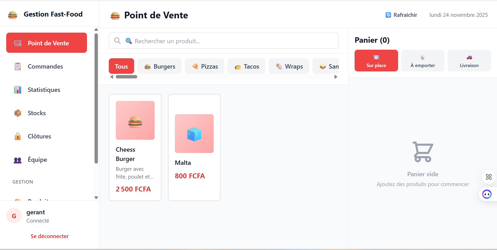
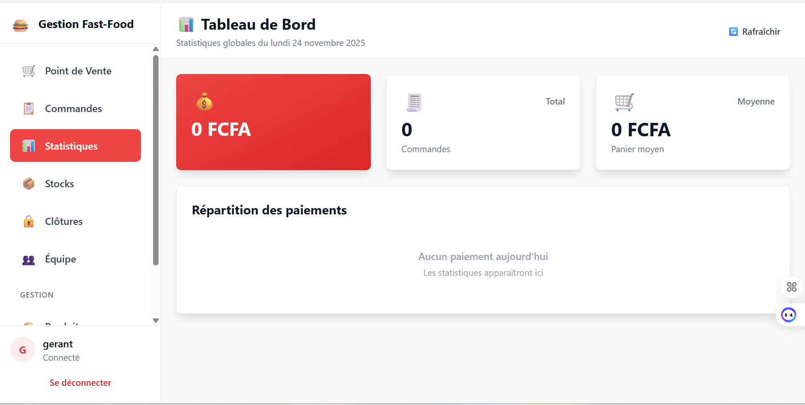
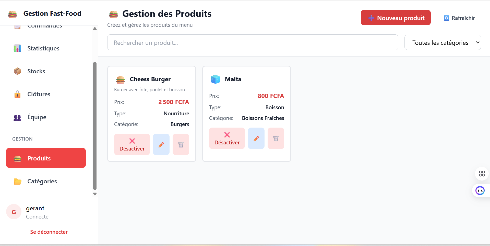

# 🍔 FastFood - Système de Gestion de Restaurant

Application complète de gestion pour restaurants fast-food : Point de Vente (POS), gestion des commandes, statistiques, clôtures de caisse, et plus encore.

[]()
[]()
[]()

---

## 🚀 DÉMARRAGE RAPIDE (3 clics)

### Windows (Recommandé pour restaurants)

```batch
1. Installer Docker Desktop : https://www.docker.com/products/docker-desktop
2. Double-cliquer sur : install-windows.bat
3. Ouvrir http://localhost
```

**✨ Installation terminée en 10 minutes !**

### Linux / Mac

```bash
docker-compose up -d
# Ouvrir http://localhost
```

---

## 🔑 CONNEXION PAR DÉFAUT

```
Username : admin
Password : Admin123
```

⚠️ **IMPORTANT** : Changez ce mot de passe après la première connexion !

---

## 📚 DOCUMENTATION COMPLÈTE

| Guide | Description | Pour qui |
|-------|-------------|----------|
| **[🪟 Guide Windows](GUIDE_WINDOWS.md)** | Installation et utilisation Windows avec Docker | Restaurateurs, Utilisateurs finaux |
| **[🐧 Guide Déploiement](GUIDE_DEPLOIEMENT.md)** | Déploiement professionnel Ubuntu, réseau local, multi-postes | Développeurs, Installateurs |
| **[🔐 Sécurité](SECURITY.md)** | Vulnérabilités corrigées, guide migration JWT | Développeurs |
| **[⚡ README Sécurité](README_SECURITE.md)** | Actions requises, démarrage rapide sécurisé | Tous |

---

## ✨ FONCTIONNALITÉS

### 🛒 Point de Vente (POS)
- ✅ Interface tactile intuitive et rapide
- ✅ Gestion du panier en temps réel
- ✅ Paiements multiples (CB, Espèces, etc.)
- ✅ Impression automatique des tickets
- ✅ Options et modifications de produits
- ✅ Mode plein écran (kiosque)

### 📊 Statistiques et Rapports
- ✅ Chiffre d'affaires par période
- ✅ Ventes par produit/catégorie
- ✅ Performance par employé
- ✅ Graphiques interactifs (Recharts)
- ✅ Export des données

### 🔒 Clôtures de Caisse
- ✅ Clôture journalière automatique
- ✅ Récapitulatif détaillé des ventes
- ✅ Validation par manager
- ✅ Historique complet

### 👥 Gestion des Utilisateurs
- ✅ 5 rôles : ADMIN, MANAGER, CASHIER, KITCHEN, WAITER
- ✅ Permissions granulaires (RBAC)
- ✅ Authentification sécurisée (JWT + bcrypt)
- ✅ Logs d'activité complets
- ✅ Création/modification/désactivation

### 🍕 Gestion des Produits
- ✅ Catégories personnalisables avec emojis
- ✅ 43 catégories pré-remplies (burgers, pizzas, tacos...)
- ✅ Images de produits
- ✅ Gestion des stocks et ingrédients
- ✅ Prix et coûts
- ✅ Disponibilité en temps réel

### 🎨 Personnalisation
- ✅ Logo personnalisé
- ✅ Couleurs de marque (thème dynamique)
- ✅ Nom du restaurant
- ✅ Paramètres d'impression
- ✅ Configuration flexible

---

## 🏗️ ARCHITECTURE

```
┌──────────────────────────────────────────┐
│   Frontend (React + Vite + Tailwind)    │
│   - Point de Vente (POS) tactile        │
│   - Tableaux de bord interactifs        │
│   - Gestion complète                    │
└──────────────┬───────────────────────────┘
               │ REST API (JWT)
┌──────────────▼───────────────────────────┐
│   Backend (Node.js 20 + Fastify)        │
│   - API REST sécurisée                  │
│   - JWT + bcrypt + Rate limiting        │
│   - RBAC granulaire                     │
│   - Activity logging                    │
└──────────────┬───────────────────────────┘
               │ Prisma ORM
┌──────────────▼───────────────────────────┐
│   Base de données (PostgreSQL 15)       │
│   - Produits, Catégories, Commandes     │
│   - Utilisateurs, Rôles, Permissions    │
│   - Paiements, Clôtures, Statistiques   │
│   - Logs d'activité, Audit trail        │
└──────────────────────────────────────────┘
```

---

## 🔐 SÉCURITÉ

✅ **Authentification JWT** - Tokens signés avec secret fort, expiration 24h
✅ **Mots de passe hashés** - bcrypt avec 10 rounds (SALT)
✅ **RBAC complet** - Contrôle d'accès basé sur 5 rôles
✅ **Rate Limiting** - Protection brute force (5 tentatives/15min sur login)
✅ **CORS sécurisé** - Whitelist des origines (production)
✅ **Headers Helmet** - Content Security Policy, XSS Protection
✅ **Validation Zod** - Validation stricte des entrées
✅ **Activity Logging** - Traçabilité complète (connexions, modifications)
✅ **Protection CSRF** - Prêt pour activation

**Score de sécurité : 7/10** ✅ Prêt pour production

**Vulnérabilités corrigées** :
- ❌ Mots de passe en clair → ✅ bcrypt
- ❌ Pas d'authentification → ✅ JWT
- ❌ Escalade de privilèges → ✅ RBAC
- ❌ Routes publiques → ✅ Protégées
- ❌ CORS ouvert → ✅ Whitelist

---

## 🛠️ TECHNOLOGIES

### Frontend
- **React 18** + TypeScript
- **Vite** - Build ultra-rapide
- **Tailwind CSS** - Styling moderne
- **Zustand** - State management
- **Recharts** - Graphiques interactifs
- **Axios** - HTTP client

### Backend
- **Node.js 20** + TypeScript
- **Fastify** - Framework performant
- **Prisma ORM** - Type-safe database
- **PostgreSQL 15** - Base de données robuste
- **@fastify/jwt** - Authentification
- **bcrypt** - Hachage sécurisé
- **@fastify/rate-limit** - Protection DDoS

### DevOps & Production
- **Docker** + Docker Compose
- **Nginx** - Reverse proxy
- **PM2** - Process manager (optionnel)

---

## 🖥️ COMMANDES UTILES

### Avec Docker (Production)

```bash
# Démarrer (Windows : start.bat)
docker-compose up -d

# Arrêter (Windows : stop.bat)
docker-compose stop

# Voir les logs (Windows : logs.bat)
docker-compose logs -f

# Sauvegarder (Windows : backup.bat)
docker-compose exec postgres pg_dump -U fastfood_admin fastfood_db > backup.sql

# Restaurer
docker-compose exec -T postgres psql -U fastfood_admin -d fastfood_db < backup.sql

# Redémarrer
docker-compose restart

# Mettre à jour
git pull && docker-compose up -d --build
```

### Développement (Manuel)

```bash
# Backend
cd backend
npm install
npm run prisma:generate
npm run migrate:deploy
npm run hash-passwords  # Hasher les mots de passe !
npm run dev

# Frontend (nouveau terminal)
cd frontend
npm install
npm run dev
```

---

## 💰 DÉPLOIEMENT RESTAURANT

### Budget Estimé

| Configuration | Matériel | Installation | Total |
|---------------|----------|--------------|-------|
| **Petit** (1-2 postes) | 1500-2000€ | 500€ | **2000-2500€** |
| **Professionnel** (3-6 postes) | 5500-11000€ | 1500€ | **7000-12500€** |

### ROI (Retour sur Investissement)

- ⏱️ **Gain de temps** : 5-10h/semaine
- 📉 **Réduction erreurs** : -30%
- 📊 **Meilleur suivi** : Stats temps réel
- 💵 **Amortissement** : **3-6 mois**

### Matériel Recommandé

```
🖥️ 1 Serveur (mini PC)        → 700-1000€
💻 2-4 PC caisses tactiles     → 400€ chacun
📱 2-4 Tablettes (cuisine)     → 250€ chacune
🖨️ Imprimantes thermiques     → 200€ chacune
📶 Réseau (switch + WiFi)      → 300€
🔌 Onduleur (protection)       → 200€
```

---

## 📦 INSTALLATION DÉTAILLÉE

### Option 1 : Docker (Recommandé - 10 minutes)

```bash
# 1. Installer Docker Desktop
# Windows : https://www.docker.com/products/docker-desktop
# Linux : curl -fsSL https://get.docker.com | sh

# 2. Cloner le projet
git clone https://github.com/VotreCompte/Gestion_Fast_Food.git
cd Gestion_Fast_Food

# 3. Windows : Double-clic sur install-windows.bat
# Linux/Mac :
docker-compose up -d

# 4. Ouvrir http://localhost
```

### Option 2 : Manuel (Développement)

Voir [GUIDE_DEPLOIEMENT.md](GUIDE_DEPLOIEMENT.md) pour instructions complètes.

---

## ❓ PROBLÈMES FRÉQUENTS

### Docker ne démarre pas

```powershell
# Windows : Redémarrer WSL
wsl --shutdown

# Vérifier Docker
docker --version
docker ps
```

### Port 80 occupé

```yaml
# Modifier docker-compose.yml
frontend:
  ports:
    - "8080:80"  # Changer le port
```

### 401 Unauthorized

- Token JWT expiré → Se déconnecter/reconnecter
- Vérifier `JWT_SECRET` dans `backend/.env`

Plus de solutions : [GUIDE_WINDOWS.md - Problèmes Fréquents](GUIDE_WINDOWS.md#problèmes-fréquents)

---

## 🎯 ROADMAP

### Version 1.0 (Actuel) ✅
- [x] Point de Vente complet
- [x] Gestion commandes/produits/utilisateurs
- [x] Statistiques et clôtures
- [x] Sécurité JWT + bcrypt + RBAC
- [x] Docker + Guide Windows
- [x] 43 catégories pré-remplies

### Version 2.0 (Q2 2025) 🚧
- [ ] Application Electron Desktop (.exe Windows)
- [ ] Impression silencieuse native
- [ ] Mode offline (PWA)
- [ ] Synchronisation multi-restaurants
- [ ] Rapports avancés (Excel, PDF)

### Version 3.0 (Q4 2025) 🔮
- [ ] Application mobile (React Native)
- [ ] Intégrations (comptabilité, livraison)
- [ ] IA : Prédictions de ventes
- [ ] Dashboard temps réel (WebSocket)

---

## 🤝 CONTRIBUTION

Les contributions sont bienvenues !

1. Fork le projet
2. Créer une branche (`git checkout -b feature/MaSuperFeature`)
3. Commit (`git commit -m 'feat: Ajout MaSuperFeature'`)
4. Push (`git push origin feature/MaSuperFeature`)
5. Ouvrir une Pull Request

---

## 📄 LICENCE

MIT License - Libre d'utilisation commerciale

Copyright (c) 2025 OPS CORPORATION

---

## 📞 SUPPORT & CONTACT

**OPS CORPORATION**
📧 Email: cmaathey@gmail.com

- 📖 **Documentation** : Voir les fichiers `.md` dans le projet
- 💡 **Questions** : Contactez-nous à cmaathey@gmail.com
- 📧 **Support Commercial** : cmaathey@gmail.com

---

## ⭐ STAR LE PROJET

Si ce projet vous aide, donnez-lui une étoile ! ⭐

**Cela aide énormément pour la visibilité du projet.**

---

## 📸 CAPTURES D'ÉCRAN

### Point de Vente


### Dashboard


### Gestion Produits


---

**Made with ❤️ for fast-food restaurants by OPS CORPORATION**

**Prêt pour la production | Sécurisé | Facile à déployer**

🍔 🍕 🌮 🍟 🥤

---

**OPS CORPORATION** | 📧 cmaathey@gmail.com
